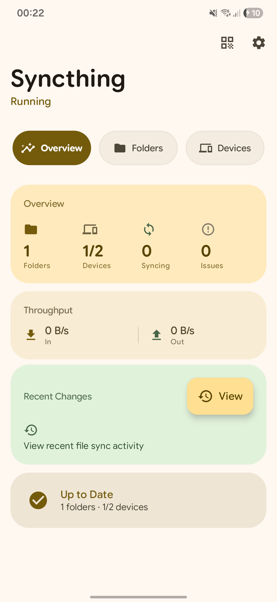
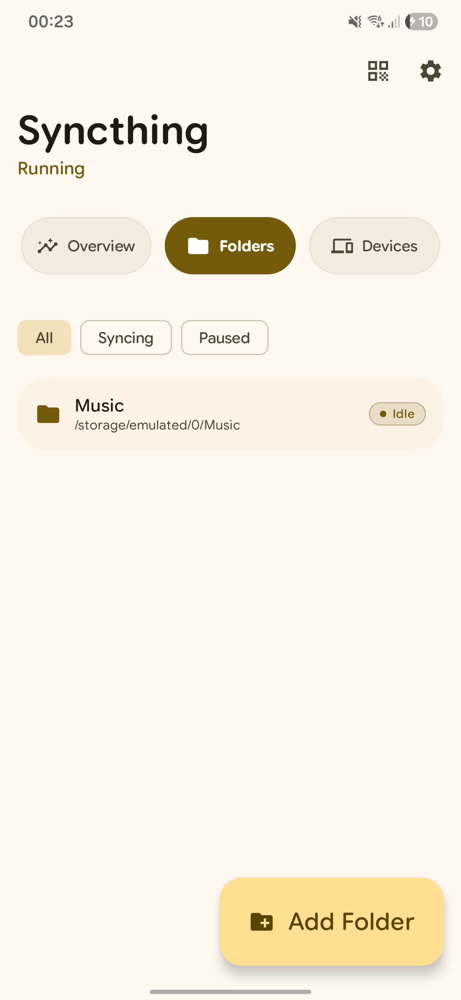
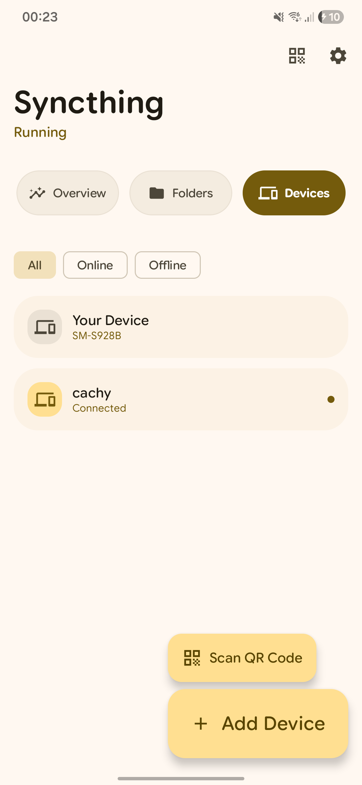
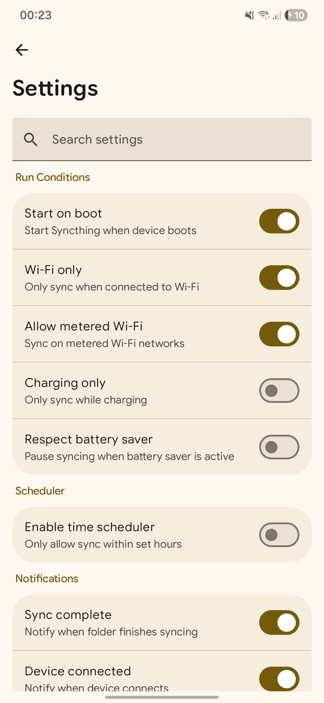
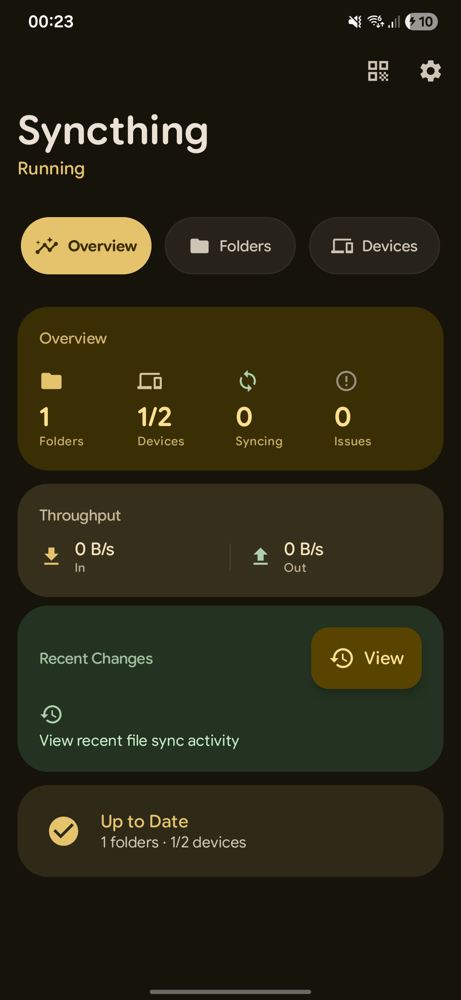
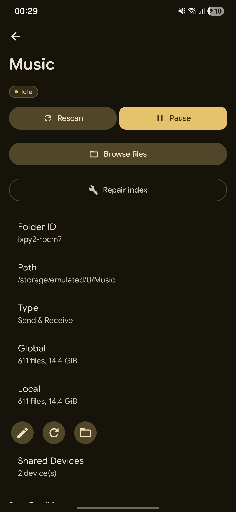
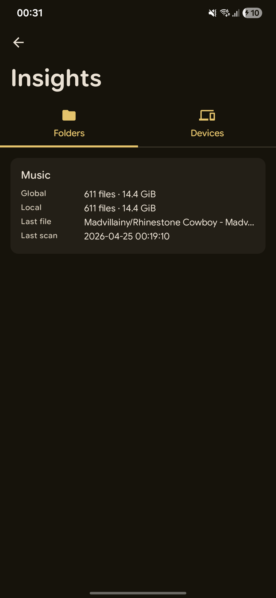
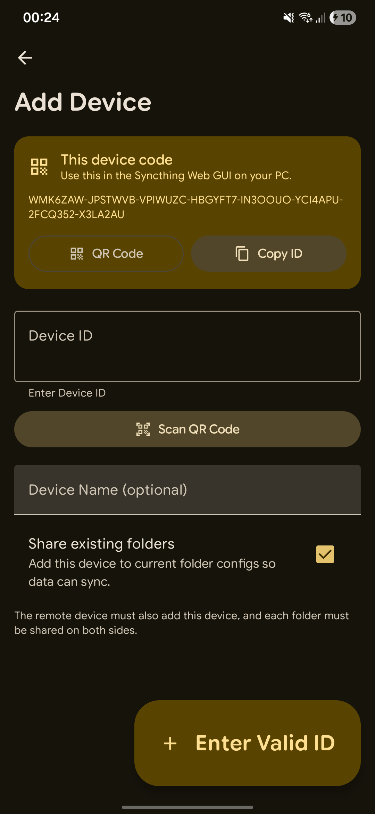

<div align="center">


# Material Syncthing: A modern, beautiful Android client for [Syncthing](https://syncthing.net/)
Thanks for the great work regarding the UI @lostf1sh. The main goal of this [fork](https://github.com/lostf1sh/material-syncthing) is to provide a more stable and reliable experience for users, while also adding new features and enhancements.


[](https://github.com/sirulex/material-syncthing/actions)
[](LICENSE)
[-3b82f6?logo=android)](https://developer.android.com/about/versions/9)
[-8b5cf6?logo=android)](https://developer.android.com/about/versions/15)
[](https://developer.android.com/jetpack/compose)

<p align="center">
  
  
  
  
</p>

<p align="center">
  
  
  
  
</p>

</div>

---


## What is this?

Material Syncthing is a ground-up rebuild of the Syncthing Android client, written in **Kotlin** with **Jetpack Compose** and **Material 3 Expressive**. It replaces the legacy View/XML UI with a modern, fluid interface built for Android 9+.

Originally ported from [Catfriend1/syncthing-android](https://github.com/Catfriend1/syncthing-android), this project strips away the Java/XML legacy in favor of coroutines, Flow, and Compose — end to end.

---
## Download the latest release from [GitHub Releases](https://github.com/sirulex/material-syncthing/releases)
Best add it to [Obtainium](https://github.com/ImranR98/Obtainium) for automatic updates. If you want to build from source, see the [Build](#build) section below.

---

## Features

|                                   |                                                                                       |
| --------------------------------- | ------------------------------------------------------------------------------------- |
| 🎨**Material 3 Expressive** | Wavy progress indicators, expressive motion, flexible top app bars, spring animations |
| 📁**Folder Management**     | Create, edit, browse, pause/resume, repair index, ignore patterns                     |
| 📱**Device Management**     | Add via ID or QR scan, share existing folders, connection status                      |
| 🔄**Real-time Sync**        | Foreground`dataSync` service with persistent notification, boot-on-start            |
| 📊**Insights Dashboard**    | Bandwidth history, sync health, recent changes, conflict resolution                   |
| 🔔**Smart Notifications**   | Error center, device connection alerts, sync completion                               |
| 🔒**Privacy First**         | No analytics, no cloud — your data stays on your devices                             |
| 🌙**Dynamic Color**         | Full Material You dynamic theming on Android 12+                                      |

---

## Tech Stack

| Layer                  | Tech                                                                    |
| ---------------------- | ----------------------------------------------------------------------- |
| **UI**           | Jetpack Compose + Material 3 Expressive (`1.5.0-alpha17`)             |
| **Architecture** | Coroutines + Flow,`StateFlow` for UI state, `SharedFlow` for events |
| **Networking**   | Ktor client + OkHttp + kotlinx.serialization                            |
| **DI**           | Manual composition (`AppContainer`) — no framework overhead          |
| **Persistence**  | DataStore (preferences), Room-ready architecture                        |
| **Native**       | Embedded syncthing binary launched via ProcessBuilder                   |
| **Build**        | Gradle 9.x, Kotlin 2.2.10, Version Catalogs                             |

---

## Architecture

```
┌─────────────┐     ┌──────────────┐     ┌─────────────┐
│     app     │────▶│   ui-core    │────▶│  core-api   │
│  (Screens)  │     │(Theme/Design)│     │(REST Client)│
└──────┬──────┘     └──────────────┘     └──────┬──────┘
       │                                          │
       ▼                                          ▼
┌──────────────┐     ┌──────────────┐     ┌─────────────┐
│    data      │◀────│AppContainer  │◀────│core-service │
│(Repo/Settings)│     │ (State Hub)  │     │(Foreground) │
└──────────────┘     └──────────────┘     └─────────────┘
                            │
                            ▼
                     ┌──────────────┐
                     │  core-native │
                     │(Binary Launch)│
                     └──────────────┘
```

- **Coroutines + Flow** end to end. No AIDL, no listener callbacks.
- **StateFlow** shared via `AppContainer` singleton — tiles and UI read the same flows.
- **Cancellation-safe** — every suspend handler rethrows `CancellationException`.

---

## Build

**Debug APK:**

```bash
./gradlew :app:assembleDebug
```

**Release APK:**

```bash
./gradlew :app:assembleRelease
```

**Install:**

```bash
./gradlew :app:installDebug
```

**Run tests:**

```bash
./gradlew test
```

---

## Modules

| Module           | Purpose                                                                      |
| ---------------- | ---------------------------------------------------------------------------- |
| `app`          | Activity, navigation, screen composables, DI wiring                          |
| `core-native`  | Native binary launcher, config bootstrapper, run state                       |
| `core-service` | Foreground service, notifications, boot receiver                             |
| `core-api`     | Ktor REST client, event stream parser, DTOs                                  |
| `data`         | DataStore settings, repositories, sync constraints, health                   |
| `ui-core`      | Shared Compose theme (`SyncthingTheme`), expressive components, formatters |

---

## Requirements

- Android 9 (API 28) or higher
- Target SDK 35, Compile SDK 36
- JDK 17

---

## Screenshots

> To generate screenshots, run the app on an emulator or device and capture the following flows:
>
> - **Light**: Home overview → Folders list → Devices list → Settings
> - **Dark**: Home overview → Folder detail → Insights → Add device
>
> Save them to `.github/screenshots/` as `home_light.png`, `folders_light.png`, etc.

---

## Permissions

- `INTERNET` — Syncthing REST API
- `FOREGROUND_SERVICE_DATA_SYNC` — Persistent sync service
- `POST_NOTIFICATIONS` — Service state and error notifications
- `RECEIVE_BOOT_COMPLETED` — Auto-start on boot
- `CAMERA` — QR code scanning
- `MANAGE_EXTERNAL_STORAGE` (API 30+) — Folder access

---

## Known follow-up work

- Configuration backups restore app preferences, folders, devices, and Syncthing options on the same device. Device identity (`cert.pem` / `key.pem`) migration is intentionally not implemented.
- Android cloud document providers do not expose filesystem paths usable by the native Syncthing process. Primary storage and UUID-based removable volumes are supported; virtual providers would require a separate copy/cache layer.
- External file versioning requires an executable command supplied by the user and still needs device-specific validation on Android.

---

## License

[MPL-2.0](LICENSE). See [NOTICE](NOTICE) for upstream attribution.

This project is a derivative of [Catfriend1/syncthing-android](https://github.com/Catfriend1/syncthing-android) and fork of [lostf1sh/material-syncthing](https://github.com/lostf1sh/material-syncthing), rebuilt with Compose and modern Android architecture.
